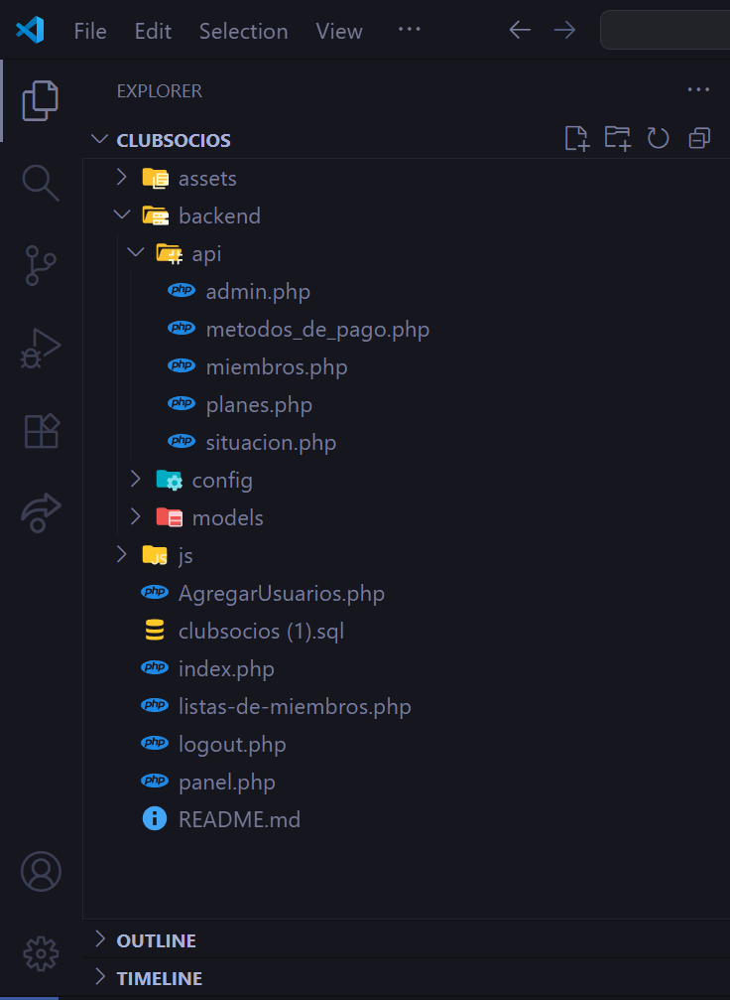
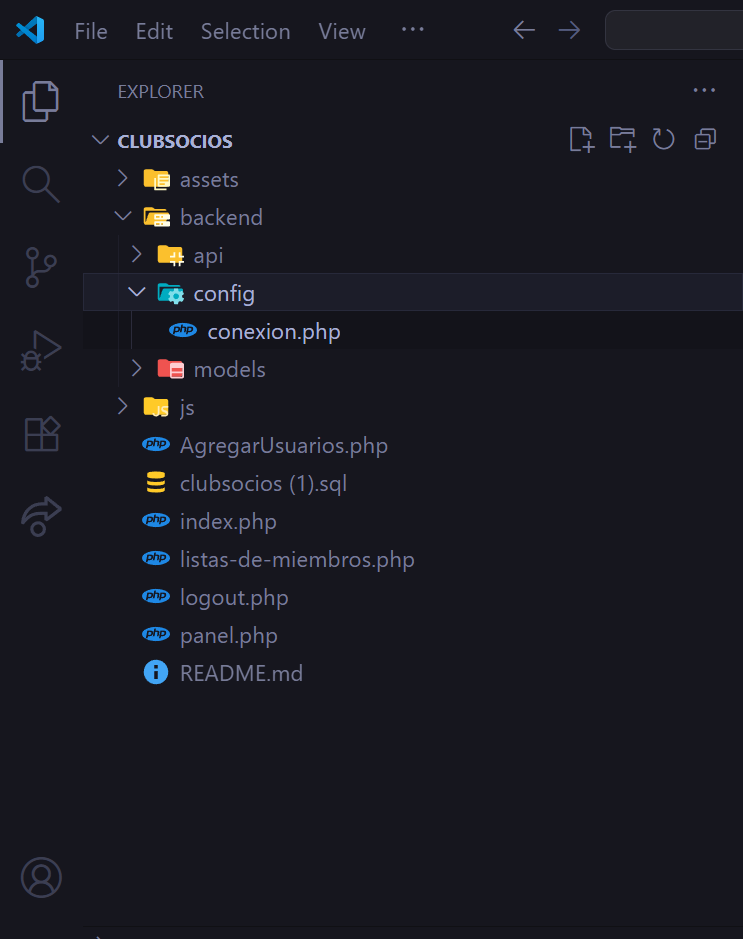
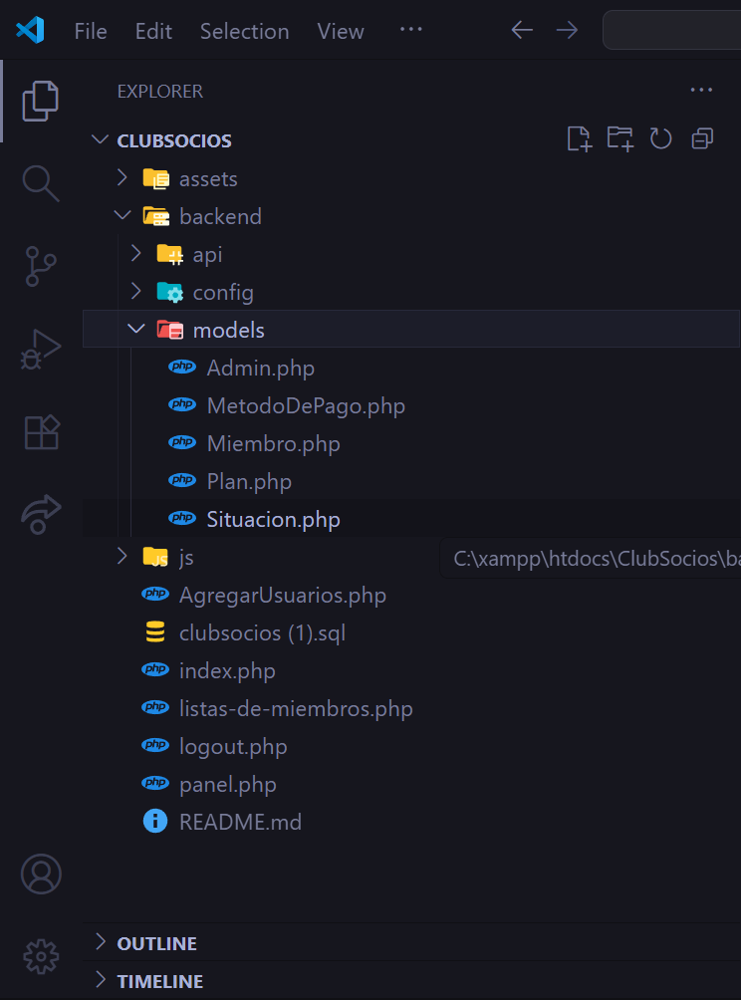
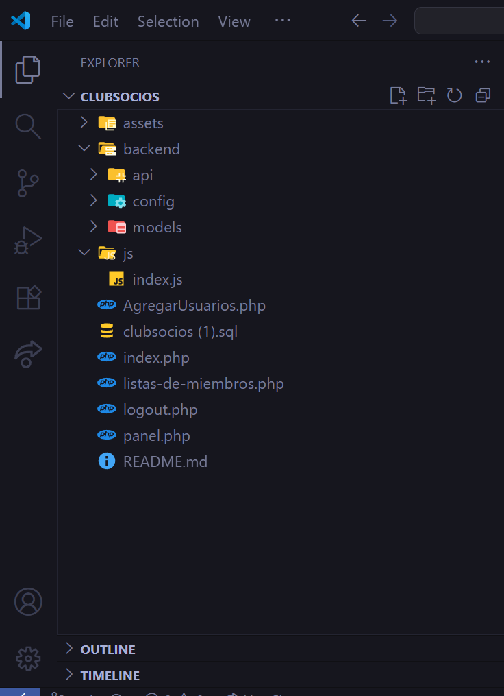
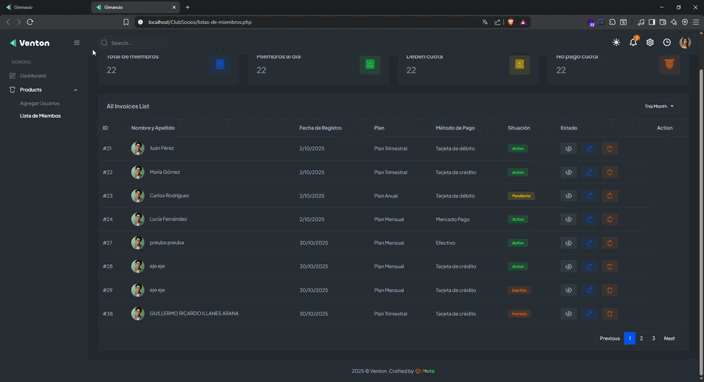

# 🏋️‍♂️ ClubSocios — Sistema de Gestión de Miembros

> **Por favor leer antes de ver el código.**


---

### 🔑 Credenciales de acceso
**Usuario:** `admin`  
**Contraseña:** `1`

---

## 📘 Introducción

Esta es una guía para entender mejor el código y el porqué de su estructura.

> ⚠️ **Importante:**  
> No tocar nada en la carpeta `assets/`, ya que no contiene POO.  
> Solo incluye funciones y recursos de la plantilla.

---

## 🗂️ Estructura del proyecto

### 📁 Estructura general

La siguiente imagen muestra la estructura principal del proyecto, donde destaca la carpeta `api`, que contiene toda nuestra API con sus respectivos archivos.



---

### ⚙️ Carpeta `config`

Contiene el archivo de conexión a la base de datos (`db.php`).



---

### 🧩 Carpeta `models`

Incluye los archivos de los modelos que representan las entidades del sistema.



---

### 💻 Carpeta `js`

Contiene **toda la lógica funcional** en el archivo `index.js`.

> ⚠️ **No confundir con la carpeta `assets/js/`**, que pertenece únicamente a la plantilla.



---

## 📄 Explicación de archivos principales

### 🧍‍♂️ `AgregarUsuarios.php`

- Desde la **línea 546** comienza el formulario con sus respectivos inputs.  
- En la **línea 661** se deja un pequeño script que permite que, al usar el lector de código de barras, se reconozca automáticamente un DNI y se completen los campos de nombre y apellido.
- El archivo finaliza en la **línea 866**, justo antes del botón para enviar el formulario.

📌 **Dato curioso:**  
Si se intenta guardar un DNI duplicado, se genera un error debido al **índice único** en la tabla `miembros`.  
Esto evita duplicar registros, ya que no debería haber dos miembros con el mismo DNI.



**Lógica asociada:**  
En `js/index.js`, desde la **línea 1 hasta la 78**.

---

### 📋 `listas-de-miembros.php`

- Desde la **línea 556**, se encuentran los cuadros informativos:
  - Total de miembros  
  - Miembros al día  
  - Deben cuota  
  - No pagó cuota  

  Estos cuadros no hacen nada en especial, solo muestran valores ilustrativos.

- Las filas y columnas reales que muestran los datos dinámicos se generan **desde la línea 640 hasta la 697**.

**Lógica asociada:**  
En `js/index.js`, desde la **línea 84 hasta la 168**.  
Aquí se usa generación dinámica de HTML con estilos para mostrar los datos en tablas.

---

### 🧾 `panel.php`

Este archivo contiene la **verificación de miembros**, permitiendo ingresar un **DNI** o un **código NFC**.

- Si el miembro existe, se muestran sus datos, foto y un botón para renovar la cuota (sin acción especial por ahora).  
- Si el código o DNI no pertenecen a un miembro registrado, se reproduce un **sonido de error**:

html
<!-- Sonido de error -->
<audio id="audio-error" src="assets/sounds/error.mp3" preload="auto"></audio>

El contenido de interés va desde la **línea 561 hasta la 611**.

Entre las **líneas 607 y 608** hay una función que detecta si el DNI no pertenece a un miembro y **emite el sonido de error**.

---

### 🧠 Lógica asociada
En `js/index.js`, desde la **línea 172 hasta la 331**.

---

## ⚠️ Consideraciones importantes

Si descargas el archivo y **no lo guardas con el nombre exacto `proyecto-socios`**, podrías tener problemas con las rutas relativas del **JavaScript**.  
Esto ocurre porque los métodos `fetch()` utilizan rutas relativas al directorio principal.

---

## 🧰 Tecnologías utilizadas


💡 **Proyecto desarrollado completamente en PHP puro (sin frameworks ni POO).**

---

## ⚙️ Instalación

Si deseas clonar y probar el proyecto localmente:

```bash
# Clonar el repositorio
git clone https://github.com/guille2506/proyecto-socios

# Ingresar al proyecto
cd proyecto-socios


