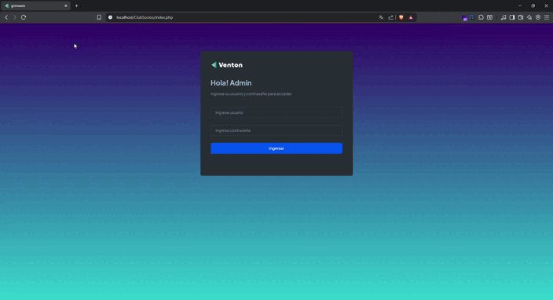
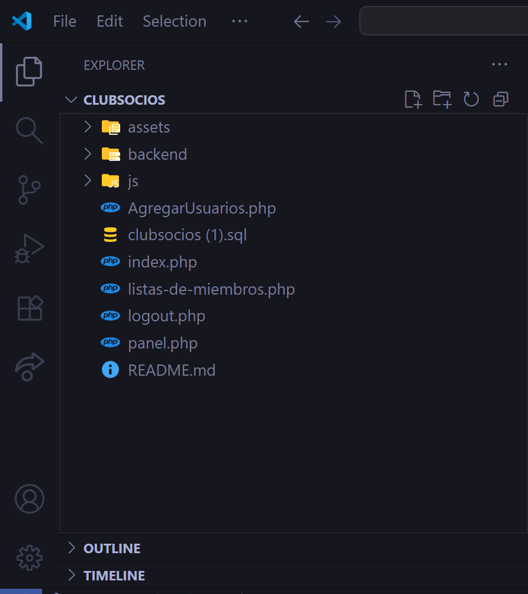

# Porfavor leer antes de ver el codigo 




Credenciales user : admin contraseña : 1

esta es una guia , para ayudar a entender mejor el codigo y el de porque las cosas son asi 

No tocar nada en assets , no hay nada de poo , solo Funciones de la plantilla 


como acabo de mencionar la estrucura que se ve en la imagen muestra un carpeta llamda api la cual contine toda nuestra api , con sus respectivos archivos (foto)

tenemos tambin la carpeta config donde se encuetra el archivo de db (foto)

le sigue la carpeta models con sus repectivos archivos (foto)

esta toda la logica en la carpeta js en su archivo index.js NO CONFUNDIR LA CARPETA JS QUE ESTA DENTRO DE LA CARPETA ASSETS !(foto)


una vez explicado todo procedo a explicar el codigo en el archivo AgregarUsuarios.php  desde la linea 546 empieza nuestro formulario con sus respectivos inputs, hemos decidido dejar en la linea 661 un script que creo que no molesta porque es una pequeña logica
que usamos para cuando usamos el lector de codigo de barras pueda reconocer un dni y acomode automaticamente los campos de nombre , apellido etc . nuestro AgregarUsuarios.php termina en la linea 866 justo antes de terminar se encuentra el boton para poder enviar los campos previamente rellenados 

un dato curioso si nosotros guardamos un dni 2 veces en la db se genera un error el cual no permite guardar , porque se supone que no deberia haber dni duplicados , son reglas que se puso en  la tabla miembros porque tiene  un índice único en dni, (gif mostrando el problema)

su logica en la carpeta js/index.js  empieza en la linea 1 hasta la 78 


listas-de-miembros.php

desde la linea 556 econtrara cuadros que diran  Total de miembros ,Miembros al dia,Deben cuota, No pago cuota no hacen nada en especial solo estan con un numero al alazar lo que realmente importa son las filas y columnas que se generan que empiza desde la linea 640 hasta la 697 (foto)


su logica en la carpeta js/index.js  empieza en la linea 84 hasta la 168 se ocupo generacion de html con su respectivo estilo para aprovechar al maximo el uso de datos atraves de tablas 

panel.php
es donde se encuntra la verificaion de miembros si existen o no atraves de su input para ingresa dni o codigo de la tarjeta ndf
si encuentra un miembro mostrara sus datos,foto , y un boton para renovar cuota que no hace nada en especial , se puede econtrar desde la linea 561 hasta la 611  SI revisa hay         desde la liena 607 hasta la 608 pero no hace tampoco nada especial tratamos de manteneros lo mas simple era una funcion nque si detectaba que si alguien ingresaba un dni o codigo que no era un miembro  este realiza un sonido de error                                <!-- Sonido de error -->
                                        <audio id="audio-error" src="assets/sounds/error.mp3" preload="auto"></audio>
                                        
su logica en la carpeta js/index.js  empieza en la linea 172 hasta la 331 


Esto es una aplicación web desarrollada como parte del Challenge Amigo Secreto de **Alura Latam**.
Permite a los usuarios ingresar nombres de amigos, mostrarlos en una lista y realizar un sorteo aleatorio para determinar quién es el amigo secreto.

<br>
##  Funcionalidades

- **Agregar Amigos**: Al ingresar un nombre en el campo de texto  es añadido a la lista.
- **Validación de entrada**: Si el campo de texto está vacío, muestra un mensaje de error.
- **Lista de Amigos**: Muestra todos los amigos ingresados dinámicamente en la página.
- **Sorteo aleatorio**: Selecciona un nombre al azar de la lista y lo muestra como "amigo secreto".

##  Tecnologías utilizadas


 
##  Vista Previa


## 🚀 Prueba la Demo!
[](https://guille2506.github.io/Challenge_AmigoSecreto/)


## 🛠 Instalación 

Si quieres clonarlo y probarlo localmente:

 ```bash
# Clonar el repositorio
git clone https://github.com/guille2506/Challenge_AmigoSecreto.git

# Abrir el archivo
cd Challenge_AmigoSecreto
