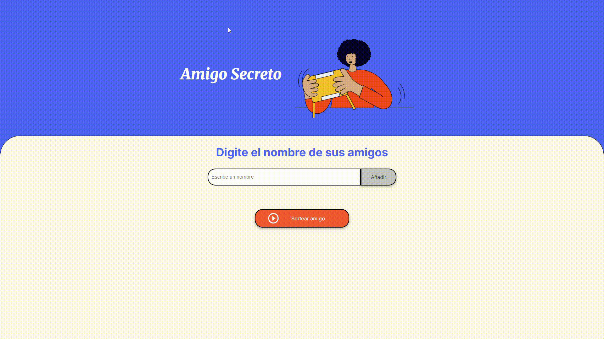

# Challenge Del Amigo Secreto 🎁


Esto es una aplicación web que permite a los usuarios ingresar nombres de amigos, mostrarlos en una lista 
y realizar un sorteo aleatorio para determinar quién es el **amigo secreto**.


##  Funcionalidades

- **Agregar Amigos**: Al ingresar un nombre en el campo de texto  es añadido a la lista.
- **Validación de entrada**: Si el campo está vacío, muestra un mensaje de error.
- **Lista de Amigos**: Muestra todos los amigos ingresados dinámicamente en la página.
- **Sorteo aleatorio**: Selecciona un nombre al azar de la lista y lo muestra como "amigo secreto".

##  Tecnologías utilizadas
## 📋 Tabla de Contenidos
1. [Descripción](#-descripción)
2. [Funcionalidades](#-funcionalidades)
3. [Tecnologías utilizadas](#-tecnologías-utilizadas)
4. [Vista previa](#-vista-previa)
5. [Probar Demo](#-probar-demo)
6. [Instalación](#-instalación)


 
##  Vista Previa



##  Probar Demo!
https://guille2506.github.io/Challenge_AmigoSecreto/


## 🛠 Instalación 

Si quieres clonarlo y probarlo localmente:

```bash
# Clonar el repositorio
git clone https://github.com/guille2506/Challenge_AmigoSecreto.git

# Abrir el archivo
cd Challenge_AmigoSecreto
